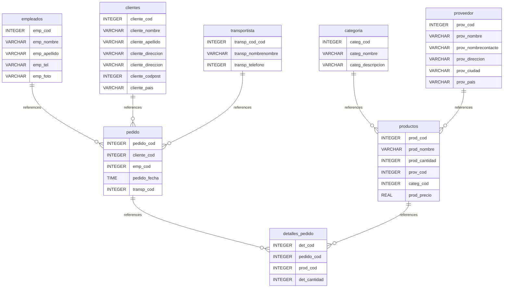

# Electronix
Venta de Productos Electronicos
## INDICE

	- [Electronix-db](#Electronix-db)
	- [INDICE](#indice)
	- [Introduction](#introduction)
	- [Database type](#database-type)
	- [Table structure](#table-structure)
		- [empleados](#empleados)
		- [clientes](#clientes)
		- [transportista](#transportista)
		- [pedidos](#pedidos)
		- [detalles_pedido](#detalles_pedido)
		- [producto](#producto)
		- [proveedor](#proveedor)
		- [categoria](#categoria)
	- [Relationships](#relationships)
	- [Database Diagram](#database-diagram)

## Introduction

## Database type

- **Database system:** PostgreSQL
## Table structure

### empleados

| Name        | Type          | Settings                      | References                    | Note                           |
|-------------|---------------|-------------------------------|-------------------------------|--------------------------------|
| **emp_cod** | INTEGER | 🔑 PK, not null, unique, autoincrement |fk_empleados_emp_cod_pedido | |
| **emp_nombre** | VARCHAR | not null |  | |
| **emp_apellido** | VARCHAR | not null |  | |
| **emp_tel** | INTEGER |not null |  | |
| **emp_foto** | BINARIO | not null |  | |

### clientes

| Name        | Type          | Settings                      | References                    | Note                           |
|-------------|---------------|-------------------------------|-------------------------------|--------------------------------|
| **cliente_cod** | INTEGER | 🔑 PK, not null, unique, autoincrement | fk_clientes_cliente_cod_pedido | |
| **cliente_nombre** |VARCHAR  | not null |  | |
| **cliente_apellido** | VARCHAR | not null |  | |
| **cliente_direccion** | VARCHAR | not null |  | |
| **cliente_ciudad** | VARCHAR | not null |  | |
| **cliente_codpost** | INTEGER | not null |  | |
| **cliente_pais** | VARCHAR | not null |  | |

### transportista

| Name        | Type          | Settings                      | References                    | Note                           |
|-------------|---------------|-------------------------------|-------------------------------|--------------------------------|
| **transp_cod** | INTEGER | 🔑 PK, not null, unique, autoincrement | fk_transportista_transp_cod_pedido | |
| **transp_nombre** | VARCHAR | not null |  | |
| **transp_telefono** | VARCHAR | not null |  | |

### pedido

| Name        | Type          | Settings                      | References                    | Note                           |
|-------------|---------------|-------------------------------|-------------------------------|--------------------------------|
| **pedido_cod** | INTEGER | not null, autoincrement | fk_pedido_pedido_cod_detalle_pedido | |
| **cliente_cod** | INTEGER | not null |  | |
| **emp_cod** | INTEGER | null |  | |
| **pedido_fecha** | TIME | null |  | |
| **transp_cod** | INTEGER | null |  | |

### productos

| Name        | Type          | Settings                      | References                    | Note                           |
|-------------|---------------|-------------------------------|-------------------------------|--------------------------------|
| **prod_cod** | INTEGER | 🔑 PK, not null, unique, autoincrement | fk_productos_prod_cod_detalle_pedido | |
| **prod_nombre** | VARCHAR | not null |  | |
| **prod_cantidad** | INTEGER | not null |  | |
| **prov_cod** | INTEGER | not null |  | |
| **categ_cod** | INTEGER | null |  | |
| **prod_precio** | REAL | not null |  | |

### categoria

| Name        | Type          | Settings                      | References                    | Note                           |
|-------------|---------------|-------------------------------|-------------------------------|--------------------------------|
| **categ_cod** | INTEGER | 🔑 PK, not null, unique, autoincrement | fk_categoria_categ_cod_productos | |
| **categ_nombre** | VARCHAR | not null |  | |
| **categ_descripcion** | VARCHAR | not null |  | |

### proveedor

| Name        | Type          | Settings                      | References                    | Note                           |
|-------------|---------------|-------------------------------|-------------------------------|--------------------------------|
| **prov_cod** | INTEGER | 🔑 PK, not null, unique, autoincrement | fk_proveedor_prov_cod_productos | |
| **prov_nombre** | VARCHAR | not null |  | |
| **prov_nombrecontacto** | VARCHAR | not null |  | |
| **prov_direccion** | VARCHAR | not null |  | |
| **prov_ciudad** | VARCHAR | not null |  | |
| **prov_pais** | VARCHAR | not null |  | |

### detalles_pedido

| Name        | Type          | Settings                      | References                    | Note                           |
|-------------|---------------|-------------------------------|-------------------------------|--------------------------------|
| **det_cod** | INTEGER | not null, autoincrement |  | |
| **pedido_cod** | INTEGER | not null |  | |
| **prod_cod** | INTEGER | not null |  | |
| **det_cantidad** | INTEGER | not null |  | |

## Relationships

- **empleados to pedido**: one_to_many
- **cliente to pedido**: one_to_many
- **transportista to pedido**: one_to_many
- **pedido to detalles_pedido**: one_to_many
- **productos to detalles_pedido**: one_to_many
- **categoria to productos**: one_to_many
- **proveedor to productos**: one_to_many

## Database Diagram

